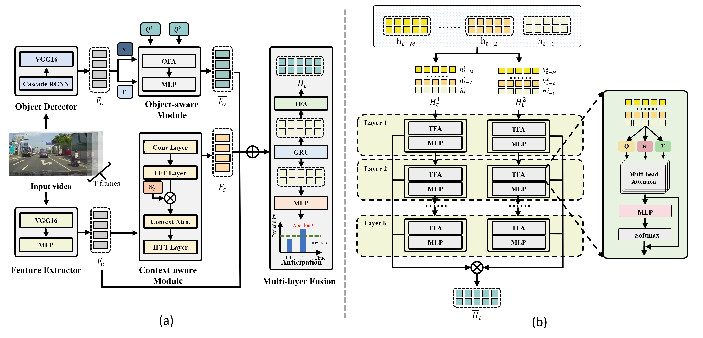

# CRASH: Crash Recognition and Anticipation System Harnessing with Context-Aware and Temporal Focus Attentions

This repository contains the official implementation of  **CRASH: Crash Recognition and Anticipation System Harnessing with Context-Aware and Temporal Focus Attentions**.

## Highlights
- We present a novel context-aware module that extends global interactions into the frequency domain using FFT and introduces **context-aware attention blocks** to compute fine-grained correlations between nuanced spatial and appearance changes in different objections. Enhanced by the proposed **multi-layer fusion**, this framework dynamically prioritizes risks in various regions, enriching visual cues for accident anticipation.

- To realistically simulate the variability and randomness of missing data that is commonly encountered in real-world driving, we augment the renowned DAA, A3D, and CCD datasets with scenarios featuring **missing data**. This innovation expands the research scope for accident detection models and provides comprehensive benchmarks for evaluating model performance.

- In benchmark tests conducted on the enhanced DAD, A3D, and CCD datasets, CRASH demonstrates superior performance over state-of-the-art (SOTA) baselines across key metrics, such as Average Precision (AP) and mean Time-To-Accident (mTTA). This showcases its remarkable accuracy and applicability across a variety of challenging scenarios, including those with **10\%-50\% data-missing** and **limited 50\%-75\% training set** scenes.
  

## Background

Accurately and promptly predicting accidents among surrounding traffic agents from camera footage is crucial for the safety of autonomous vehicles (AVs). This task presents substantial challenges stemming from the unpredictable nature of traffic accidents, their long-tail distribution, the intricacies of traffic scene dynamics, and the inherently constrained field of vision of onboard cameras. To address these challenges, this study introduces a novel accident anticipation framework for AVs, termed CRASH. It seamlessly integrates five components: object detector, feature extractor, object-aware module, context-aware module, and multi-layer fusion. Specifically, we develop the object-aware module to prioritize high-risk objects in complex and ambiguous environments by calculating the spatial-temporal relationships between traffic agents. In parallel, the context-aware is also devised to extend global visual information from the temporal to the frequency domain using the Fast Fourier Transform (FFT) and capture fine-grained visual features of potential objects and broader context cues within traffic scenes. To capture a wider range of visual cues, we further propose a multi-layer fusion that dynamically computes the temporal dependencies between different scenes and iteratively updates the correlations between different visual features for accurate and timely accident prediction.
Evaluated on real-world datasets—Dashcam Accident Dataset (DAD), Car Crash Dataset (CCD), and AnAn Accident Detection (A3D) datasets—our model surpasses existing top baselines in critical evaluation metrics like Average Precision (AP) and mean Time-To-Accident (mTTA). Importantly, its robustness and adaptability are particularly evident in challenging driving scenarios with missing or limited training data, demonstrating significant potential for application in real-world autonomous driving systems.
<div align=center>
  
</div> 


## Our model
Architecture of CRASH Accident Anticipation model
<div align=center>
  
</div> 

The overall pipeline of CRASH is shown in Fig. \ref{fig:2}. It consists of five critical components: object detector, feature extractor, object-aware module, context-aware module, and multi-layer fusion. Initially, the object detector and feature extractor produce the object $F_o$ and context $F_c$ vectors for the raw input videos $V$. Next, the object-aware module is used to progressively update the spatial-temporal representation of the object vectors, producing the object-aware vectors $\bar{F}_o$. In parallel, the context vectors $F_c$ are fed into the context-aware modules for global semantic feature extraction, resulting in the context-aware vecotors  $\bar{F}_c$.
Finally, the multi-layer fusion iteratively fuses and mulls over the output from the feature extractor and these modules to identify and predict potential incidents that could lead to accidents, generating the probability $P$ for each frame of the input videos.

**Object Detector** employs a Cascade R-CNN to identify the top-n dynamic objects in the video stream and embeds these objects into vectors using VGG-16, which are essential for further spatial-temporal analysis.

**Feature Extractor** utilizes VGG-16 and Multilayer Perception (MLP) to generate context vectors from the input video. These vectors serve as the foundational data for subsequent modules to analyze and interpret.

**Object-aware Module** uses the object vectors and dual-layer hidden states encoded by a GRU, along with an Object Focus Attention (OFA) mechanism, to highlight and refine key features of traffic agents. This module helps in prioritizing high-risk objects in complex environments.

**Context-aware Module** extends analysis into the frequency domain using Fast Fourier Transform (FFT) and employs a Spectral Gating Unit (SGU) and Context-aware Attention Blocks (CAB). This module enhances the detection of nuanced visual features and broader context cues, aiding in accident anticipation.

**Multi-layer Fusion** fuses the outputs from the feature extractor and both object-aware and context-aware modules. It uses a Temporal Focus Attention (TFA) mechanism to dynamically compute dependencies between scenes and refine predictions. This iterative process ensures accurate and timely accident prediction by leveraging a wide range of visual information.


## Install

The model install in Ubuntu 20.04, cuda11.8

**1. Clone this repository**: clone our model use the following code 

```shell
git clone https://github.com/xxxxxxxxxxxx
cd CRASH
```

**2. Implementation Environment**: The model is implemented by using Pytorch. We recommend using Anaconda to creat virtual environment to run this code:

```shell
# create and activate python environment
conda create -n py38 python=3.8
conda activate py38

# install dependencies
pip install -r requiremenrs.txt
```


## Download and Pre-processing Datasets

You can get the dataset from the official link below:

DAD: https://github.com/smallcorgi/Anticipating-Accidents

CCD: https://github.com/Cogito2012/CarCrashDataset

A3D: https://github.com/MoonBlvd/tad-IROS2019

You can also use Bao et al. curated features with video frame images:

https://github.com/Cogito2012/UString


## Train and Test

**Train**: To train CRASH model from scratch, run the following commands for DAD dataset:
```shell
# For dad dataset, use GPU_ID=0 and batch_size=10.
bash run_train_test.sh train 0 dad 10
```


**Test**: Using the DAD dataset as an example, you can test the model using the following command.The default path for the test model is: `output/UString/vgg16/snapshot/final_model.pth`
```shell
# For dad dataset, use GPU_ID=0 and batch_size=10.
bash run_train_test.sh test 0 dad 10
```